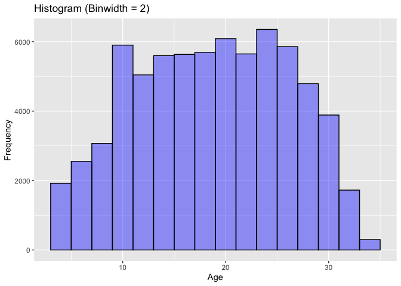
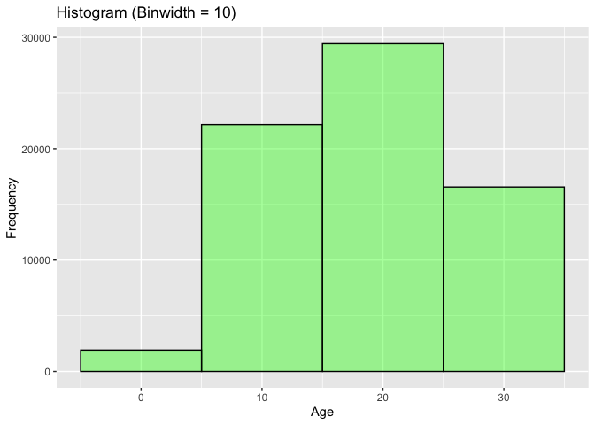
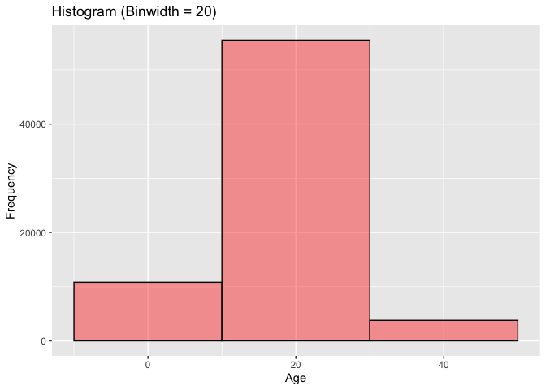
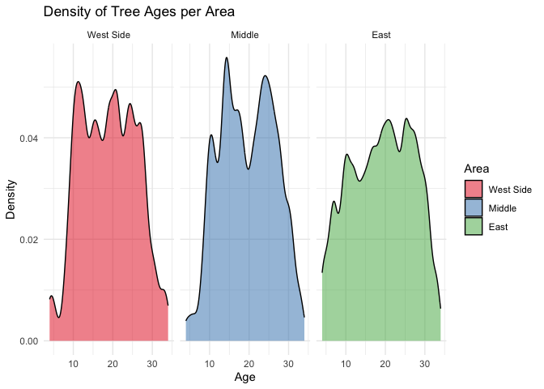

Mini Data Analysis Milestone 2
================

*To complete this milestone, you can either edit [this `.rmd`
file](https://raw.githubusercontent.com/UBC-STAT/stat545.stat.ubc.ca/master/content/mini-project/mini-project-2.Rmd)
directly. Fill in the sections that are commented out with
`<!--- start your work here--->`. When you are done, make sure to knit
to an `.md` file by changing the output in the YAML header to
`github_document`, before submitting a tagged release on canvas.*

# Welcome to the rest of your mini data analysis project!

In Milestone 1, you explored your data. and came up with research
questions. This time, we will finish up our mini data analysis and
obtain results for your data by:

- Making summary tables and graphs
- Manipulating special data types in R: factors and/or dates and times.
- Fitting a model object to your data, and extract a result.
- Reading and writing data as separate files.

We will also explore more in depth the concept of *tidy data.*

**NOTE**: The main purpose of the mini data analysis is to integrate
what you learn in class in an analysis. Although each milestone provides
a framework for you to conduct your analysis, it’s possible that you
might find the instructions too rigid for your data set. If this is the
case, you may deviate from the instructions – just make sure you’re
demonstrating a wide range of tools and techniques taught in this class.

# Instructions

**To complete this milestone**, edit [this very `.Rmd`
file](https://raw.githubusercontent.com/UBC-STAT/stat545.stat.ubc.ca/master/content/mini-project/mini-project-2.Rmd)
directly. Fill in the sections that are tagged with
`<!--- start your work here--->`.

**To submit this milestone**, make sure to knit this `.Rmd` file to an
`.md` file by changing the YAML output settings from
`output: html_document` to `output: github_document`. Commit and push
all of your work to your mini-analysis GitHub repository, and tag a
release on GitHub. Then, submit a link to your tagged release on canvas.

**Points**: This milestone is worth 50 points: 45 for your analysis, and
5 for overall reproducibility, cleanliness, and coherence of the Github
submission.

**Research Questions**: In Milestone 1, you chose two research questions
to focus on. Wherever realistic, your work in this milestone should
relate to these research questions whenever we ask for justification
behind your work. In the case that some tasks in this milestone don’t
align well with one of your research questions, feel free to discuss
your results in the context of a different research question.

# Learning Objectives

By the end of this milestone, you should:

- Understand what *tidy* data is, and how to create it using `tidyr`.
- Generate a reproducible and clear report using R Markdown.
- Manipulating special data types in R: factors and/or dates and times.
- Fitting a model object to your data, and extract a result.
- Reading and writing data as separate files.

# Setup

Begin by loading your data and the tidyverse package below:

``` r
library(datateachr) # <- might contain the data you picked!
library(tidyverse)
library(dplyr)
library(ggplot2) #for graphical tools
library(lme4)
```

# Task 1: Process and summarize your data

From milestone 1, you should have an idea of the basic structure of your
dataset (e.g. number of rows and columns, class types, etc.). Here, we
will start investigating your data more in-depth using various data
manipulation functions.

### 1.1 (1 point)

First, write out the 4 research questions you defined in milestone 1
were. This will guide your work through milestone 2:

<!-------------------------- Start your work below ---------------------------->

**Global dataset**

1.  What are the areas with the most trees ? My intuition is that there
    are more as we go to the East of Vancouver

**New dataset**

2.  Are there differences in age in the different areas ?

3.  What are significant differences between old and young, maybe
    indicating a recent change of policy in planting trees. I understand
    that since I don’t have access to the whole dataset, (i.e., the
    trees that we planted and then dead), my conclusions are limited.

4.  What could affect the age of trees: species, root_barrier ?
    <!----------------------------------------------------------------------------->

Here, we will investigate your data using various data manipulation and
graphing functions.

### 1.2 (8 points)

Now, for each of your four research questions, choose one task from
options 1-4 (summarizing), and one other task from 4-8 (graphing). You
should have 2 tasks done for each research question (8 total). Make sure
it makes sense to do them! (e.g. don’t use a numerical variables for a
task that needs a categorical variable.). Comment on why each task helps
(or doesn’t!) answer the corresponding research question.

Ensure that the output of each operation is printed!

Also make sure that you’re using dplyr and ggplot2 rather than base R.
Outside of this project, you may find that you prefer using base R
functions for certain tasks, and that’s just fine! But part of this
project is for you to practice the tools we learned in class, which is
dplyr and ggplot2.

**Summarizing:**

1.  Compute the *range*, *mean*, and *two other summary statistics* of
    **one numerical variable** across the groups of **one categorical
    variable** from your data.
2.  Compute the number of observations for at least one of your
    categorical variables. Do not use the function `table()`!
3.  Create a categorical variable with 3 or more groups from an existing
    numerical variable. You can use this new variable in the other
    tasks! *An example: age in years into “child, teen, adult, senior”.*
4.  Compute the proportion and counts in each category of one
    categorical variable across the groups of another categorical
    variable from your data. Do not use the function `table()`!

**Graphing:**

6.  Create a graph of your choosing, make one of the axes logarithmic,
    and format the axes labels so that they are “pretty” or easier to
    read.
7.  Make a graph where it makes sense to customize the alpha
    transparency.

Using variables and/or tables you made in one of the “Summarizing”
tasks:

8.  Create a graph that has at least two geom layers.
9.  Create 3 histograms, with each histogram having different sized
    bins. Pick the “best” one and explain why it is the best.

Make sure it’s clear what research question you are doing each operation
for!

<!------------------------- Start your work below ----------------------------->

I will create a new categorical variable that will help me identify the
areas of Vancouver with the most trees. Based of the map of Vancouver, I
will define 3 regions, from West to East. East Vancouver has longitude
approximately above -123.1, Fairview + Mount pleasant + Downtown are
between -123.14 and -123.1, and West Side Vancouver + Kitsilano are
approximately below -123.14. The division is approximative, but I think
it will already show a gap in the population of trees in Vancouver. If
anything, the way I defined “West Side Vancouver”, is with slightly less
trees that it should since it covers a bit more East than Kitsilano. UBC
is not part of the dataset. I assume that the “Middle” category will
have fewer trees, and East Van will have the most.

``` r
#categorize the trees per area
vancouver_trees <- vancouver_trees %>% 
  mutate(Area = factor(case_when(longitude < -123.14 ~ "West Side",
                                longitude < -123.1 ~ "Middle",
                                TRUE ~ "East"),
                      levels = c("West Side", "Middle", "East")))

# Calculate the count of trees per species in each area.
result <- vancouver_trees %>%
  group_by(Area, species_name) %>%
  summarise(count = n())
```

    ## `summarise()` has grouped output by 'Area'. You can override using the
    ## `.groups` argument.

``` r
#Let us see now the count of trees in each area
count_trees <- vancouver_trees %>%
  group_by(Area) %>%
  mutate(count = n()) %>%
  arrange(desc(count))

ggplot(count_trees, aes(Area)) + geom_bar()
```

<!-- -->
This is what I thought: East Van has the most trees, (as it is bigger,
and with a less densely in population), West is behind, with way less
trees, and the middle area, grouping Mount Pleasant, Fairview and
Downtown has the least number of trees. None of the graphical
instructions really made sense for this specific question, which is why
I did two summarizing questions instead of one.

Now, to answer the other questions, let us look at the age of the trees.
Let us first look at the age distribution, and choose the proper
histogram features for it. This will help understanding the patterns a
little better.

``` r
#Define an age variable.
vancouver_trees <- vancouver_trees %>% mutate(Age = 2023 - year(date_planted))

#Look at its range
range(vancouver_trees$Age,na.rm = TRUE)
```

    ## [1]  4 34

``` r
#let us look at the global distribution of the age
# Create three histograms with different bin sizes
histogram1 <- ggplot(vancouver_trees, aes(x = Age)) +
  geom_histogram(binwidth = 2, fill = "blue",alpha=0.4, color = "black") +
  labs(title = "Histogram (Binwidth = 2)", x = "Age", y = "Frequency")

histogram2 <- ggplot(vancouver_trees, aes(x = Age)) +
  geom_histogram(binwidth = 10, fill = "green",alpha=0.4, color = "black") +
  labs(title = "Histogram (Binwidth = 10)", x = "Age", y = "Frequency")

histogram3 <- ggplot(vancouver_trees, aes(x = Age)) +
  geom_histogram(binwidth = 20, fill = "red", alpha=0.4,color = "black") +
  labs(title = "Histogram (Binwidth = 20)", x = "Age", y = "Frequency")

# Print all three histograms
histogram1
```

    ## Warning: Removed 76548 rows containing non-finite values (`stat_bin()`).

<!-- -->

``` r
histogram2
```

    ## Warning: Removed 76548 rows containing non-finite values (`stat_bin()`).

<!-- -->

``` r
histogram3
```

    ## Warning: Removed 76548 rows containing non-finite values (`stat_bin()`).

<!-- -->

``` r
#histogram1 is the best.


# Now let us look at the summary statistics of Age per area. Probably the trees grow older in East and West Van since they have more space and less disturbance
result.summary <- vancouver_trees %>%
  group_by(Area) %>%
  summarise(
    age_min = min(Age, na.rm = TRUE),       #range
    age_max = max(Age, na.rm = TRUE),
    age_mean = mean(Age, na.rm = TRUE),     #average of age
    age_median = median(Age, na.rm = TRUE), #median of age
    age_sd = sd(Age, na.rm = TRUE)          #sd of age
  )
```

With the binwidth = 20, I miss many details, specifically, how is the
spread of my data. I can not really understand the distribution of the
age variable. Similarly for the second histogram. The blue histogram is
the best to me, because it shows that the distribution of trees in
Vancouver is mostly flat. Namely, there are trees between $10$ and $30$
in similar proportions, and the tail for “old” trees is smaller than for
“young” trees. Let us now look at the distribution of age per area.

The summary statistics for the `Age` variable for every area are very
similar, the median and mean are the same. Only the sd is slightly
different. The distribution of age does not really look like anything
per area. East Van has wider tails. Now let us look more in details in
old and young trees. First, we need to categorize the age, in `young`,
`adults` and `old` categories.

``` r
#categorize the trees per age
vancouver_trees_oldyoung <- vancouver_trees %>% 
  mutate(generation = factor(case_when(Age < 10 ~ "young",
                                Age < 30 ~ "adult",
                                TRUE ~ "old"),
                      levels = c("young", "adult", "old")))

#Now, let us look at the proportion of "young", "old" and "adult" trees in each area.
proportion_data <- vancouver_trees_oldyoung %>%
  group_by(Area, generation) %>%
  summarize(count = n()) %>%
  group_by(Area) %>%
  mutate(proportion = count / sum(count))
```

    ## `summarise()` has grouped output by 'Area'. You can override using the
    ## `.groups` argument.

``` r
# Display the result
print(proportion_data)
```

    ## # A tibble: 9 × 4
    ## # Groups:   Area [3]
    ##   Area      generation count proportion
    ##   <fct>     <fct>      <int>      <dbl>
    ## 1 West Side young        966     0.0274
    ## 2 West Side adult      12193     0.346 
    ## 3 West Side old        22049     0.626 
    ## 4 Middle    young        837     0.0277
    ## 5 Middle    adult      12490     0.413 
    ## 6 Middle    old        16943     0.560 
    ## 7 East      young       5739     0.0707
    ## 8 East      adult      31927     0.394 
    ## 9 East      old        43467     0.536

``` r
#Plot the density of the age per area
ggplot(vancouver_trees, aes(x = Age, fill = Area)) +
  geom_density(alpha = 0.5) +
  labs(title = "Density of Tree Ages per Area",
       x = "Age",
       y = "Density") +
  scale_fill_brewer(palette = "Set1") +  # Change the color palette if needed
  theme_minimal() +
  facet_wrap(~ Area)
```

    ## Warning: Removed 76548 rows containing non-finite values (`stat_density()`).

<!-- -->

The plots confirm the summary statistics: the distribution of the age of
trees does not seem different per area. Thus the counts and proportions
of old/young/adults within the area are similar. Therefore, the area is
probably not a significant factor for the trees’ life expectancy. Let us
now look at if there are some other reasons for the trees to be older or
not. For example, do the trees by a root_barrier tend to live a shorter
life ?

``` r
# Load the necessary libraries
library(ggplot2)
library(dplyr)


#Look at the summary statistics of Age, across the root_barrier variable
result <- vancouver_trees %>%
  group_by(root_barrier) %>%
  summarise(
    age_min = min(Age, na.rm = TRUE),       #range
    age_max = max(Age, na.rm = TRUE),
    age_mean = mean(Age, na.rm = TRUE),     #average of age
    age_median = median(Age, na.rm = TRUE), #median of age
    age_sd = sd(Age, na.rm = TRUE)          #sd of age
  )
result
```

    ## # A tibble: 2 × 6
    ##   root_barrier age_min age_max age_mean age_median age_sd
    ##   <chr>          <dbl>   <dbl>    <dbl>      <dbl>  <dbl>
    ## 1 N                  4      34     19.6         21   7.76
    ## 2 Y                  4      31     15.8         16   3.13

``` r
# Create a density plot for each value of the "root_barrier" variable
ggplot(vancouver_trees, aes(x = Age, fill = root_barrier)) +
  geom_density(alpha = 0.5) +
  labs(title = "Density of Tree Ages by Root Barrier",
       x = "Age",
       y = "Density")
```

    ## Warning: Removed 76548 rows containing non-finite values (`stat_density()`).

<!-- -->
Both the distributions and summary statistics of the `Age` variable are
different depending on whether there is a root barrier or not. For now,
we do not know whether this is statistically significant.

<!----------------------------------------------------------------------------->

### 1.3 (2 points)

Based on the operations that you’ve completed, how much closer are you
to answering your research questions? Think about what aspects of your
research questions remain unclear. Can your research questions be
refined, now that you’ve investigated your data a bit more? Which
research questions are yielding interesting results?

<!------------------------- Write your answer here ---------------------------->

1.  What are significant differences between old and young, maybe
    indicating a recent change of policy in planting trees. I understand
    that since I don’t have access to the whole dataset, (i.e., the
    trees that we planted and then dead), my conclusions are limited.

2.  Is root_barrier a significant factor in the age distribution of
    trees.

<!----------------------------------------------------------------------------->

# Task 2: Tidy your data

In this task, we will do several exercises to reshape our data. The goal
here is to understand how to do this reshaping with the `tidyr` package.

A reminder of the definition of *tidy* data:

- Each row is an **observation**
- Each column is a **variable**
- Each cell is a **value**

### 2.1 (2 points)

Based on the definition above, can you identify if your data is tidy or
untidy? Go through all your columns, or if you have \>8 variables, just
pick 8, and explain whether the data is untidy or tidy.

<!--------------------------- Start your work below --------------------------->

``` r
# Assuming "vancouver_trees" is your data frame
for (col in colnames(vancouver_trees)) {
  print(paste("Column:", col))
  
  # Check the class of the column
  class_check <- class(vancouver_trees %>% pull({{col}}))
  print(paste("Class:", class_check))
  
  # Check if there are unique values for each observation
  unique_check <- vancouver_trees %>%
    group_by({{col}}) %>%
    summarize(count = n()) %>%
    filter(count > 1) %>%
    nrow()
  print(paste("Unique Check:", unique_check))
  
  # Check for missing values (NA)
  na_check <- vancouver_trees %>% 
    summarize(na_count = sum(is.na({{col}}))) %>%
    pull(na_count)
  print(paste("NA Check:", na_check))
  
  cat("\n")
}
```

    ## [1] "Column: tree_id"
    ## [1] "Class: numeric"
    ## [1] "Unique Check: 1"
    ## [1] "NA Check: 0"
    ## 
    ## [1] "Column: civic_number"
    ## [1] "Class: numeric"
    ## [1] "Unique Check: 1"
    ## [1] "NA Check: 0"
    ## 
    ## [1] "Column: std_street"
    ## [1] "Class: character"
    ## [1] "Unique Check: 1"
    ## [1] "NA Check: 0"
    ## 
    ## [1] "Column: genus_name"
    ## [1] "Class: character"
    ## [1] "Unique Check: 1"
    ## [1] "NA Check: 0"
    ## 
    ## [1] "Column: species_name"
    ## [1] "Class: character"
    ## [1] "Unique Check: 1"
    ## [1] "NA Check: 0"
    ## 
    ## [1] "Column: cultivar_name"
    ## [1] "Class: character"
    ## [1] "Unique Check: 1"
    ## [1] "NA Check: 0"
    ## 
    ## [1] "Column: common_name"
    ## [1] "Class: character"
    ## [1] "Unique Check: 1"
    ## [1] "NA Check: 0"
    ## 
    ## [1] "Column: assigned"
    ## [1] "Class: character"
    ## [1] "Unique Check: 1"
    ## [1] "NA Check: 0"
    ## 
    ## [1] "Column: root_barrier"
    ## [1] "Class: character"
    ## [1] "Unique Check: 1"
    ## [1] "NA Check: 0"
    ## 
    ## [1] "Column: plant_area"
    ## [1] "Class: character"
    ## [1] "Unique Check: 1"
    ## [1] "NA Check: 0"
    ## 
    ## [1] "Column: on_street_block"
    ## [1] "Class: numeric"
    ## [1] "Unique Check: 1"
    ## [1] "NA Check: 0"
    ## 
    ## [1] "Column: on_street"
    ## [1] "Class: character"
    ## [1] "Unique Check: 1"
    ## [1] "NA Check: 0"
    ## 
    ## [1] "Column: neighbourhood_name"
    ## [1] "Class: character"
    ## [1] "Unique Check: 1"
    ## [1] "NA Check: 0"
    ## 
    ## [1] "Column: street_side_name"
    ## [1] "Class: character"
    ## [1] "Unique Check: 1"
    ## [1] "NA Check: 0"
    ## 
    ## [1] "Column: height_range_id"
    ## [1] "Class: numeric"
    ## [1] "Unique Check: 1"
    ## [1] "NA Check: 0"
    ## 
    ## [1] "Column: diameter"
    ## [1] "Class: numeric"
    ## [1] "Unique Check: 1"
    ## [1] "NA Check: 0"
    ## 
    ## [1] "Column: curb"
    ## [1] "Class: character"
    ## [1] "Unique Check: 1"
    ## [1] "NA Check: 0"
    ## 
    ## [1] "Column: date_planted"
    ## [1] "Class: Date"
    ## [1] "Unique Check: 1"
    ## [1] "NA Check: 0"
    ## 
    ## [1] "Column: longitude"
    ## [1] "Class: numeric"
    ## [1] "Unique Check: 1"
    ## [1] "NA Check: 0"
    ## 
    ## [1] "Column: latitude"
    ## [1] "Class: numeric"
    ## [1] "Unique Check: 1"
    ## [1] "NA Check: 0"
    ## 
    ## [1] "Column: Area"
    ## [1] "Class: factor"
    ## [1] "Unique Check: 1"
    ## [1] "NA Check: 0"
    ## 
    ## [1] "Column: Age"
    ## [1] "Class: numeric"
    ## [1] "Unique Check: 1"
    ## [1] "NA Check: 0"

``` r
#Look at plant_area for duplicates
unique(vancouver_trees$plant_area) # a lot of duplicates, e.g., "N" and "n".
```

    ##  [1] "N"  "4"  "B"  "6"  "3"  "5"  "2"  NA   "10" "C"  "7"  "8"  "12" "25" "40"
    ## [16] "9"  "17" "1"  "24" "11" "20" "13" "15" "16" "G"  "18" "b"  "14" "30" "c" 
    ## [31] "L"  "P"  "50" "34" "60" "M"  "21" "35" "n"  "75" "45" "19" "0"  "g"  "22"
    ## [46] "y"  "27" "32" "26"

``` r
vancouver_trees <- vancouver_trees %>%
  mutate(plant_area = str_to_title(plant_area))  #replace the duplicates, by the CAPS. Remove when it is y.

vancouver_trees <- vancouver_trees %>%
  filter(plant_area != "L" & plant_area != "M" & plant_area != "Y")  #"y" and "M" values for plant_area are not defined in the description of the dataset so I remove them

#Look at species for duplicate
# unique(vancouver_trees$species_name) #no duplicate. I comment it to not take too much space in in the .md file.
```

I identified some duplicates and removed them. Each row is now an
**observation**, each column a different **variable**, each cell a
unique **value** for the dataset that I am using.
<!----------------------------------------------------------------------------->

### 2.2 (4 points)

Now, if your data is tidy, untidy it! Then, tidy it back to it’s
original state.

If your data is untidy, then tidy it! Then, untidy it back to it’s
original state.

Be sure to explain your reasoning for this task. Show us the “before”
and “after”.

<!--------------------------- Start your work below --------------------------->

``` r
#I will use the pivot_longer function: one column per generation of age: young, adult and old
vancouver_trees <- vancouver_trees_oldyoung
vancouver_trees <-  vancouver_trees %>% pivot_wider(names_from = generation, values_from = Age) #untidy

vancouver_trees <- vancouver_trees %>%
  pivot_longer(cols = c("adult", "old", "young"), names_to = "generation", values_to = "Age", values_drop_na = TRUE) #tidy back
```

<!----------------------------------------------------------------------------->

### 2.3 (4 points)

Now, you should be more familiar with your data, and also have made
progress in answering your research questions. Based on your interest,
and your analyses, pick 2 of the 4 research questions to continue your
analysis in the remaining tasks:

<!-------------------------- Start your work below ---------------------------->

1.  What are significant differences between old and young, maybe
    indicating a recent change of policy in planting trees. I understand
    that since I don’t have access to the whole dataset, (i.e., the
    trees that we planted and then dead), my conclusions are limited.

2.  Is root_barrier a significant factor in the age distribution of
    trees ? What are the main factors influencing the age of trees in
    Vancouver ?

<!----------------------------------------------------------------------------->
<!--------------------------- Start your work below --------------------------->

I am choosing both these questions that are related because they are the
ones with the most promising results from the exploratory analysis. From
the exploratory analysis in milestone 1 and 2, root_barrier seems to
have an impact on the age, and probably some other factors too. I think
this is important to know what impacts the life expectancy of a tree in
a city for further public policies and my own personal knowledge.
<!----------------------------------------------------------------------------->

Now, try to choose a version of your data that you think will be
appropriate to answer these 2 questions. Use between 4 and 8 functions
that we’ve covered so far (i.e. by filtering, cleaning, tidy’ing,
dropping irrelevant columns, etc.).

(If it makes more sense, then you can make/pick two versions of your
data, one for each research question.)

<!-------------------------- Start your work below --------------------------->

``` r
vancouver_trees <- vancouver_trees%>% select(tree_id,species_name,root_barrier,diameter,plant_area,Area,curb,Age,generation)
vancouver_trees <- vancouver_trees %>% filter(!is.na(Age) &!is.na(curb))
vancouver_trees <- vancouver_trees %>% rename("Age_Category" = generation)

vancouver_trees_final <- vancouver_trees %>%
  mutate(Age_Category = ifelse(Age_Category == "young", 1,
              ifelse(Age_Category == "adult", 2,
              ifelse(Age_Category == "old", 3, Age_Category)))
         )

vancouver_trees_final <- filter(vancouver_trees_final,species_name != "XX")
```

I renamed the variable `generation` to `Age_Category` because I think it
will be easier to understand for someone who does not know the dataset.
Similarly, I replaced the categories of `Age_Category` by `1,2,3`
instead of `old,adult,young`. I also removed any missing values.

# Task 3: Modelling

## 3.0 (no points)

Pick a research question from 1.2, and pick a variable of interest
(we’ll call it “Y”) that’s relevant to the research question. Indicate
these.

<!-------------------------- Start your work below ---------------------------->

**Research Question**: What are the main factors influencing the age of
trees in Vancouver ?

**Variable of interest**: age of trees

<!----------------------------------------------------------------------------->

## 3.1 (3 points)

Fit a model or run a hypothesis test that provides insight on this
variable with respect to the research question. Store the model object
as a variable, and print its output to screen. We’ll omit having to
justify your choice, because we don’t expect you to know about model
specifics in STAT 545.

- **Note**: It’s OK if you don’t know how these models/tests work. Here
  are some examples of things you can do here, but the sky’s the limit.

  - You could fit a model that makes predictions on Y using another
    variable, by using the `lm()` function.
  - You could test whether the mean of Y equals 0 using `t.test()`, or
    maybe the mean across two groups are different using `t.test()`, or
    maybe the mean across multiple groups are different using `anova()`
    (you may have to pivot your data for the latter two).
  - You could use `lm()` to test for significance of regression
    coefficients.

<!-------------------------- Start your work below ---------------------------->

``` r
fm1 <- lmer(Age~root_barrier + plant_area  + (1|species_name) +(1|Area),vancouver_trees_final)
fm2 <-  lmer(Age~root_barrier + plant_area  + (1|species_name) ,vancouver_trees_final)
fm3 <- lm(Age~root_barrier + plant_area + species_name, vancouver_trees_final)
fm4 <- lm(Age~root_barrier + plant_area, vancouver_trees_final)

AIC(fm1,fm2,fm3,fm4)
```

    ##      df      AIC
    ## fm1  50 446626.5
    ## fm2  49 446668.1
    ## fm3 268 446265.0
    ## fm4  48 459609.8

The best fit model is the linear regression, with no random effects
since it is the one with the lowest AIC score. Therefore, I choose to
continue the analysis with the estimates of fm3. The AIC selection
identified the fact that `Area` does not need to be included in the
model and that the age of the tree depends on its species (reasonnable).
<!----------------------------------------------------------------------------->

## 3.2 (3 points)

Produce something relevant from your fitted model: either predictions on
Y, or a single value like a regression coefficient or a p-value.

- Be sure to indicate in writing what you chose to produce.
- Your code should either output a tibble (in which case you should
  indicate the column that contains the thing you’re looking for), or
  the thing you’re looking for itself.
- Obtain your results using the `broom` package if possible. If your
  model is not compatible with the broom function you’re needing, then
  you can obtain your results by some other means, but first indicate
  which broom function is not compatible.

<!-------------------------- Start your work below ---------------------------->

I want to see the p.value of the root_barrierY variable

``` r
library(broom)
resultfit <- tidy(fm3)
filter(resultfit,term=="root_barrierY")
```

    ## # A tibble: 1 × 5
    ##   term          estimate std.error statistic p.value
    ##   <chr>            <dbl>     <dbl>     <dbl>   <dbl>
    ## 1 root_barrierY    -3.40    0.0790     -43.0       0

The variable `root_barrierY` has p.value $0$. I think this is probably
rounding the small p.value to $0$. However, the model estimates show
that the presence of root barrier decreases the life expectancy of a
tree by $3$ years on average. Thus, when considering `root_barrier`,
`plant_area` and `species_name`, the variable `root_barrier` has a
significant effect on the Age if the tree. Similarly, `plant_area` and
`species_name` have to be considered to properly model the age of the
trees in Vancouver.
<!----------------------------------------------------------------------------->

# Task 4: Reading and writing data

Get set up for this exercise by making a folder called `output` in the
top level of your project folder / repository. You’ll be saving things
there.

## 4.1 (3 points)

Take a summary table that you made from Task 1, and write it as a csv
file in your `output` folder. Use the `here::here()` function.

- **Robustness criteria**: You should be able to move your Mini Project
  repository / project folder to some other location on your computer,
  or move this very Rmd file to another location within your project
  repository / folder, and your code should still work.
- **Reproducibility criteria**: You should be able to delete the csv
  file, and remake it simply by knitting this Rmd file.

<!-------------------------- Start your work below ---------------------------->

``` r
library(here)
```

    ## here() starts at /Users/fannydupont/Desktop/PhD/Courses/STAT 545 A/MDA/mda-Fanny-Dupont

``` r
output_folder <- here("Milestone2/output")  # Define the path to the output folder

# Create the CSV file path within the 'output' folder
csv_file_path <- file.path(output_folder, "result_summary.csv")
write_csv(result.summary, csv_file_path)
```

<!----------------------------------------------------------------------------->

## 4.2 (3 points)

Write your model object from Task 3 to an R binary file (an RDS), and
load it again. Be sure to save the binary file in your `output` folder.
Use the functions `saveRDS()` and `readRDS()`.

- The same robustness and reproducibility criteria as in 4.1 apply here.

<!-------------------------- Start your work below ---------------------------->

``` r
# Save the model as an RDS file in the output folder
model_file_path <- here::here("Milestone2/output", "trees_age.RDS")
saveRDS(fm3, model_file_path)

# Load the model from the RDS file
model <- readRDS(model_file_path)
```

<!----------------------------------------------------------------------------->

# Overall Reproducibility/Cleanliness/Coherence Checklist

Here are the criteria we’re looking for.

## Coherence (0.5 points)

The document should read sensibly from top to bottom, with no major
continuity errors.

The README file should still satisfy the criteria from the last
milestone, i.e. it has been updated to match the changes to the
repository made in this milestone.

## File and folder structure (1 points)

You should have at least three folders in the top level of your
repository: one for each milestone, and one output folder. If there are
any other folders, these are explained in the main README.

Each milestone document is contained in its respective folder, and
nowhere else.

Every level-1 folder (that is, the ones stored in the top level, like
“Milestone1” and “output”) has a `README` file, explaining in a sentence
or two what is in the folder, in plain language (it’s enough to say
something like “This folder contains the source for Milestone 1”).

## Output (1 point)

All output is recent and relevant:

- All Rmd files have been `knit`ted to their output md files.
- All knitted md files are viewable without errors on Github. Examples
  of errors: Missing plots, “Sorry about that, but we can’t show files
  that are this big right now” messages, error messages from broken R
  code
- All of these output files are up-to-date – that is, they haven’t
  fallen behind after the source (Rmd) files have been updated.
- There should be no relic output files. For example, if you were
  knitting an Rmd to html, but then changed the output to be only a
  markdown file, then the html file is a relic and should be deleted.

Our recommendation: delete all output files, and re-knit each
milestone’s Rmd file, so that everything is up to date and relevant.

## Tagged release (0.5 point)

You’ve tagged a release for Milestone 2.

### Attribution

Thanks to Victor Yuan for mostly putting this together.
